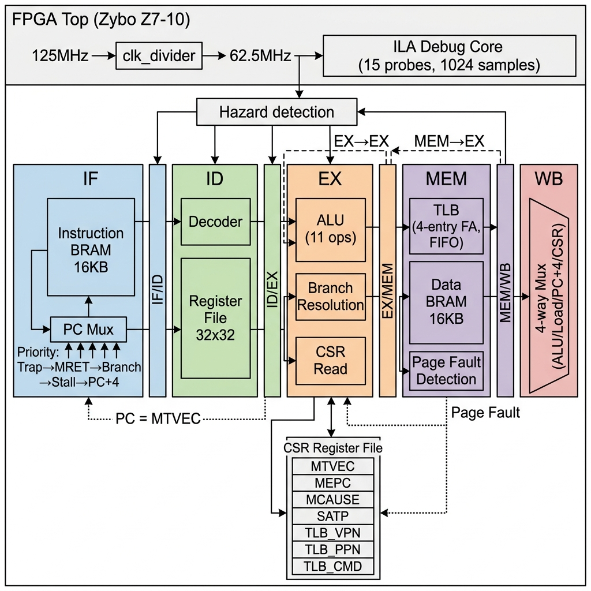
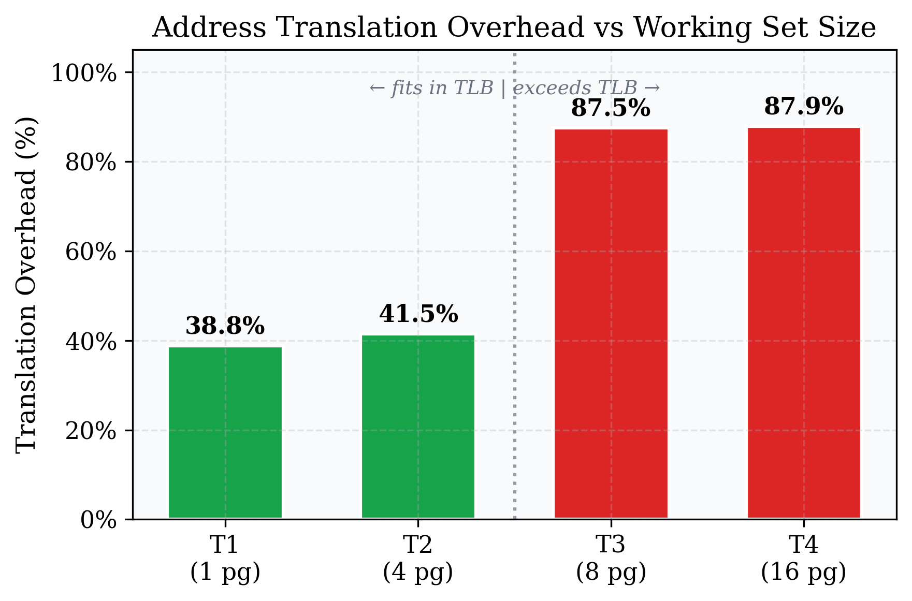
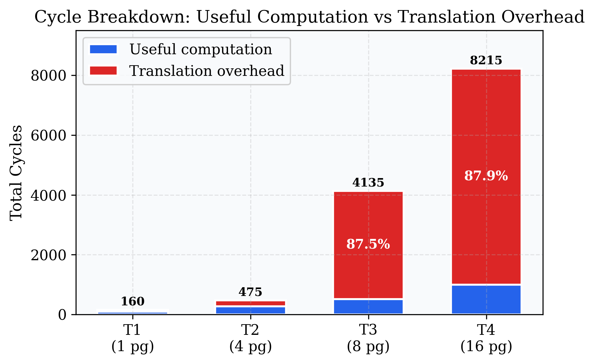
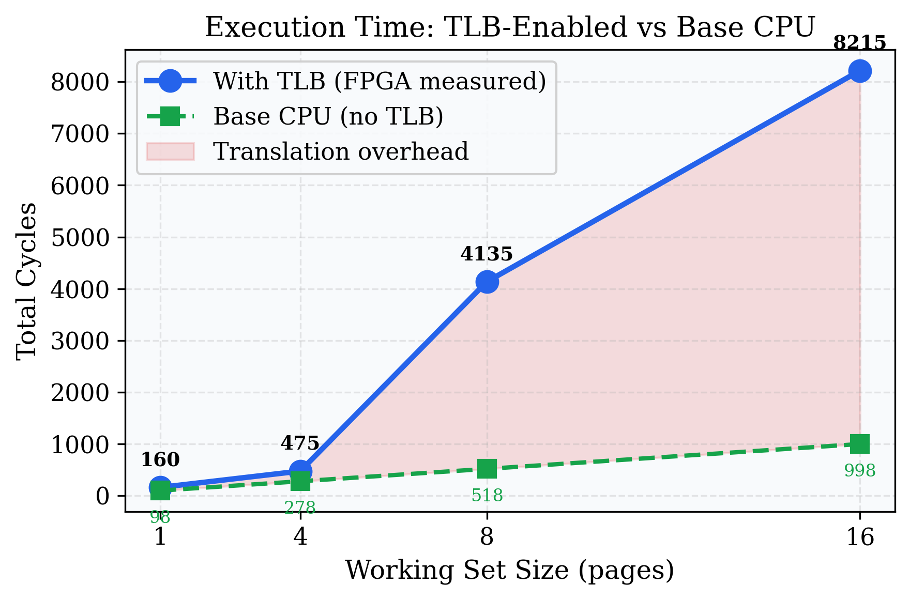
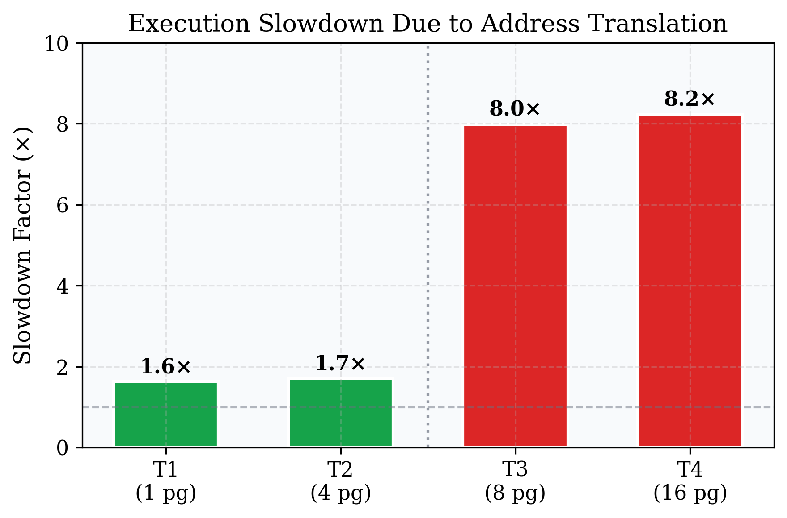

<p align="center">
  
</p>

<h1 align="center">RISC-V RV32I Pipelined CPU with Sv32 Software-Managed TLB</h1>

<p align="center">
  <a href="#overview"></a>
  <a href="#fpga-deployment"></a>
  <a href="#tlb-design"></a>
  <a href="#performance-results"></a>
  <a href="LICENSE"></a>
</p>

<p align="center">
  A complete 5-stage pipelined RISC-V processor with software-managed virtual memory,<br/>
  designed to empirically demonstrate the <strong>TLB capacity cliff</strong> on real FPGA hardware.
</p>

---

## Table of Contents

- [Overview](#overview)
- [Key Features](#key-features)
- [Architecture](#architecture)
- [TLB Design](#tlb-design)
- [Performance Results](#performance-results)
- [Repository Structure](#repository-structure)
- [Module Hierarchy](#module-hierarchy)
- [Design Parameters](#design-parameters)
- [Getting Started](#getting-started)
- [Verification](#verification)
- [FPGA Deployment](#fpga-deployment)
- [Documentation](#documentation)
- [Limitations & Future Work](#limitations--future-work)
- [References](#references)
- [License](#license)

---

## Overview

This project implements a complete **5-stage in-order pipelined RISC-V RV32I processor** augmented with:

- **Zicsr extension** — 6 CSR instructions + ECALL/EBREAK/MRET
- **4-entry fully-associative TLB** with FIFO replacement
- **Software-managed Sv32 page fault handler** implementing 2-level page table walks
- **Hardware performance counters** for cycle-accurate measurement
- **FPGA deployment** on Digilent Zybo Z7-10 at 62.5 MHz

### Research Question

> *What is the effective address-translation overhead as a fraction of total execution time when TLB coverage is exceeded in a software-managed TLB architecture?*

### Key Finding

When the working set exceeds TLB capacity, **87–88% of execution time is spent on address translation** — an **8× slowdown** compared to the base CPU. The sharp transition from ~42% overhead (fits in TLB) to ~88% (thrashing) demonstrates why modern processors need large, multi-level TLB hierarchies.

---

## Key Features

| Feature | Details |
|---------|---------|
| **ISA** | RV32I (40 instructions) + Zicsr (6 CSR ops) + ECALL/EBREAK/MRET |
| **Pipeline** | 5-stage (IF → ID → EX → MEM → WB) |
| **Data Forwarding** | EX→EX and MEM→EX (2-level priority bypass) |
| **Hazard Detection** | Load-use stall (1-cycle bubble) |
| **Branch Resolution** | EX stage, static not-taken prediction (2-cycle penalty) |
| **TLB** | 4-entry, fully-associative, FIFO replacement, 43 bits/entry |
| **Page Size** | 4 KB (12-bit offset) |
| **Virtual Address** | 32-bit (20-bit VPN + 12-bit offset) |
| **Physical Address** | 34-bit (22-bit PPN + 12-bit offset) |
| **CSRs** | 10 registers (7 standard M-mode + 3 custom TLB control) |
| **Performance Counters** | 6 × 32-bit (cycles, stalls, instructions, TLB stats) |
| **Memory** | 2 × 16 KB synchronous BRAM (instruction + data) |
| **Target FPGA** | Zybo Z7-10 (xc7z010clg400-1) at 62.5 MHz |
| **Debug** | Xilinx ILA (15 probes, 1024-sample depth) |
| **Source** | ~2,261 lines of synthesizable Verilog across 24 modules |

---

## Architecture

### Pipeline Diagram

```
┌─────┐   ┌─────┐   ┌─────┐   ┌─────────┐   ┌─────┐
│ IF  │──▶│ ID  │──▶│ EX  │──▶│ MEM+TLB │──▶│ WB  │
└──┬──┘   └──┬──┘   └──┬──┘   └────┬────┘   └──┬──┘
   │         │         │           │            │
   │         │    ┌────▶│◀──EX/MEM fwd─────────┘
   │         │    │    │◀──MEM/WB fwd──────────┘
   │         │    │    │
   │    ┌────┘    │    │
   │    │ Hazard  │    │    ┌─────────┐
   │    │  Unit   │    └───▶│   TLB   │ 4-entry FIFO
   │    └─────────┘         │(43b/ent)│
   │                        └────┬────┘
   │                             │ miss?
   │    ┌───────────────────┐    │
   └────│   CSR Module      │◀───┘ trap → MTVEC
        │ (MEPC,MCAUSE,...) │      MRET → MEPC
        │ + TLB_VPN/PPN/CMD │
        └───────────────────┘
```

### Hazard & Control Flow

| Hazard | Detection | Resolution | Penalty |
|--------|-----------|------------|:-------:|
| ALU→ALU (EX/MEM→EX) | Forwarding unit | Bypass mux | **0 cycles** |
| ALU→ALU (MEM/WB→EX) | Forwarding unit | Bypass mux | **0 cycles** |
| Load→Use | Hazard unit | Stall + forward next cycle | **1 cycle** |
| Taken branch | EX stage | Flush IF/ID + ID/EX | **2 cycles** |
| Trap (page fault) | MEM stage | Flush pipeline → handler | **4 cycles** |
| TLB miss (full) | MEM stage | Trap + handler + MRET + replay | **46 cycles** |

---

## TLB Design

### Structure

The TLB (`rv32i_tlb.v`, 84 lines) is a 4-entry fully-associative cache:

```
Entry[i] = { valid[1], vpn[20], ppn[22] } = 43 bits
```

- **Lookup**: Combinational parallel match across all 4 entries
- **Replacement**: FIFO via 2-bit circular write pointer
- **Fill**: Software-managed via custom CSRs (`TLB_VPN`, `TLB_PPN`, `TLB_CMD`)

### CSR Interface

| CSR | Address | Purpose |
|-----|---------|---------|
| `MSTATUS` | `0x300` | Machine status |
| `MTVEC` | `0x305` | Trap vector base |
| `MSCRATCH` | `0x340` | Scratch register |
| `MEPC` | `0x341` | Exception PC |
| `MCAUSE` | `0x342` | Trap cause code |
| `MTVAL` | `0x343` | Faulting address |
| `SATP` | `0x180` | Page table base |
| `TLB_VPN` | `0xFC0` | Custom: VPN for fill |
| `TLB_PPN` | `0xFC1` | Custom: PPN for fill |
| `TLB_CMD` | `0xFC2` | Custom: Commit/flush |

### Page Fault Flow (46 cycles/miss)

```
TLB Miss detected at MEM stage
  │
  ├─ Pipeline flush (4 cycles)
  ├─ PC → MTVEC (trap handler entry)
  │
  ├─ Handler (36 instructions):
  │   ├── Context save (6 instrs)
  │   ├── Address parsing from MTVAL (5 instrs)
  │   ├── L1 page table walk (5 instrs + 1 stall)
  │   ├── L2 page table walk (6 instrs + 1 stall)
  │   ├── TLB fill via CSRs (4 instrs)
  │   ├── Context restore (6 instrs)
  │   └── MRET (1 instr)
  │
  ├─ MRET pipeline flush (4 cycles)
  └─ Instruction replay → TLB HIT ✓
```

---

## Performance Results

### FPGA-Measured Data (Zybo Z7-10, 62.5 MHz, ILA Capture)

| Metric | T1 (1 pg) | T2 (4 pg) | T3 (8 pg) | T4 (16 pg) |
|--------|:---------:|:---------:|:---------:|:----------:|
| **TLB Fits?** | ✅ Yes | ✅ Yes | ❌ No | ❌ No |
| **Total Cycles** | 160 | 475 | **4,135** | **8,215** |
| **Retired Instructions** | 128 | 356 | **3,252** | **6,452** |
| **TLB Misses** | 1 | 4 | **80** | **160** |
| **Hit Rate (observed)** | 90.9% | 90.9% | 50%* | 50%* |
| **Overhead %** | 38.8% | 41.5% | **87.5%** | **87.9%** |
| **Slowdown vs Base** | 1.6× | 1.7× | **8.0×** | **8.2×** |

*\*The observed 50% under thrashing is misleading — each miss produces a replay hit, inflating the count. The logical miss rate is 100%.*

### The TLB Capacity Cliff

<p align="center">
  
</p>

<p align="center">
  
</p>

<p align="center">
  
</p>

<p align="center">
  
</p>

### FPGA Resource Utilization

| Resource | Used | Available | Utilization |
|----------|-----:|----------:|:-----------:|
| Slice LUTs | 9,395 | 17,600 | 53.4% |
| Slice Registers | 10,055 | 35,200 | 28.6% |
| Slices | 3,797 | 4,400 | 86.3% |
| Block RAM | 7.5 | 60 tiles | 12.5% |
| DSPs | 0 | 80 | 0% |
| **Timing** | WNS = +1.206 ns | **All MET** | 62.5 MHz |
| **Power** | 0.137 W | — | 43 mW dynamic |

---

## Repository Structure

```
riscv-sv32-software-managed-tlb/
│
├── rtl/                          # Synthesizable Verilog source (24 modules)
│   ├── fpga_top.v                    # FPGA board wrapper
│   ├── clk_divider.v                 # 125 → 62.5 MHz clock divider
│   ├── Microprocessor.v              # SoC top: CPU + memories + ILA
│   ├── Core.v                        # Pipeline orchestrator + control
│   ├── rv32i_fetch_stage.v           # IF stage (combinational)
│   ├── rv32i_if_id_reg.v             # IF/ID pipeline register
│   ├── rv32i_decode_stage.v          # ID stage (320 lines, full RV32I+Zicsr)
│   ├── register_file.v              # 32×32-bit register file
│   ├── rv32i_hazard_unit.v           # Load-use hazard detection
│   ├── rv32i_id_ex_reg.v             # ID/EX pipeline register
│   ├── rv32i_forwarding_unit.v       # EX→EX + MEM→EX forwarding
│   ├── rv32i_execute_stage.v         # EX stage (ALU + branch + trap)
│   ├── alu.v                         # 10-operation ALU
│   ├── rv32i_ex_mem_reg.v            # EX/MEM pipeline register
│   ├── rv32i_memory_stage.v          # MEM stage (TLB integration)
│   ├── rv32i_mem_wb_reg.v            # MEM/WB pipeline register
│   ├── rv32i_writeback_stage.v       # WB stage (4-way mux)
│   ├── rv32i_csr.v                   # CSR register file (10 CSRs)
│   ├── rv32i_tlb.v                   # 4-entry TLB (FIFO replacement)
│   ├── instruc_mem_top.v             # Instruction memory wrapper
│   ├── data_memory_top.v             # Data memory wrapper
│   ├── memory2.v                     # 4096×32 synchronous BRAM
│   ├── Memory.v                      # Legacy memory module
│   ├── perf_reporter.v               # Legacy UART reporter (replaced by ILA)
│   └── uart_tx.v                     # Legacy UART transmitter
│
├── sim/                          # Simulation testbenches
│   ├── microprocessor_tb.v           # Phase 0: Full RV32I ISA regression
│   ├── csr_test_tb.v                 # Phase 1: CSR + trap flow verification
│   ├── vm_tlb_tb.v                   # Phase 2-3: TLB + page fault verification
│   ├── perf_tb.v                     # Phase 4-5: Performance benchmarking
│   ├── baseline_tb.v                 # Baseline CPU cycle measurement
│   └── mem/                          # Memory initialization files
│       ├── instr.mem                     # Base ISA test program
│       ├── test_csr_instr.mem            # CSR test program
│       ├── vm_tlb_instr.mem              # VM/TLB test program
│       ├── vm_tlb_data.mem               # VM test page tables
│       ├── t_perf_instr.mem              # Performance benchmark (shared)
│       ├── t1_data.mem                   # 1-page working set
│       ├── t2_data.mem                   # 4-page working set
│       ├── t3_data.mem                   # 8-page working set
│       ├── t4_data.mem                   # 16-page working set
│       └── baseline_test.mem             # Baseline test program
│
├── docs/                         # Documentation
│   ├── project_report.tex            # IEEE-format LaTeX report
│   ├── project_report.pdf            # Compiled report
│   ├── IEEEtran.cls                  # IEEE LaTeX class file
│   └── figures/                      # Performance analysis plots
│       ├── architecture_diagram.png
│       ├── overhead_pct.{png,pdf}
│       ├── cycle_breakdown.{png,pdf}
│       ├── cycles_comparison.{png,pdf}
│       ├── hit_rate.{png,pdf}
│       ├── slowdown.{png,pdf}
│       ├── emat.{png,pdf}
│       └── miss_penalty.{png,pdf}
│
├── fpga/                         # FPGA implementation files
│   ├── zybo_z7_10.xdc                # Pin constraints (Zybo Z7-10)
│   ├── zybo_z7_10_minimal.xdc        # Minimal constraints
│   ├── zybo_z7_10_timing.xdc         # Timing constraints
│   └── create_ila.tcl                # Tcl script to generate ILA IP
│
├── scripts/                      # Utility scripts
│   └── generate_plots.py             # matplotlib plot generation
│
├── README.md                     # This file
└── LICENSE                       # MIT License
```

---

## Module Hierarchy

```
fpga_top.v                          — FPGA board wrapper
├── clk_divider.v                   — 125 → 62.5 MHz
└── Microprocessor.v                — SoC: CPU + memories + ILA
    ├── instruc_mem_top.v           — Instruction memory wrapper
    │   └── memory2.v              — 4096×32 synchronous BRAM
    ├── core.v                      — Pipeline orchestrator + control
    │   ├── rv32i_fetch_stage.v     — IF (combinational)
    │   ├── rv32i_if_id_reg.v       — IF/ID pipeline register
    │   ├── rv32i_decode_stage.v    — ID (combinational)
    │   ├── register_file.v         — 32×32-bit register file
    │   ├── rv32i_hazard_unit.v     — Load-use detection
    │   ├── rv32i_id_ex_reg.v       — ID/EX pipeline register
    │   ├── rv32i_forwarding_unit.v — EX→EX, MEM→EX bypass
    │   ├── rv32i_execute_stage.v   — EX (combinational)
    │   │   └── alu.v              — 10-operation ALU
    │   ├── rv32i_ex_mem_reg.v      — EX/MEM pipeline register
    │   ├── rv32i_memory_stage.v    — MEM + TLB integration
    │   ├── rv32i_mem_wb_reg.v      — MEM/WB pipeline register
    │   ├── rv32i_writeback_stage.v — WB (combinational)
    │   ├── rv32i_csr.v             — CSR register file (10 regs)
    │   └── rv32i_tlb.v             — 4-entry TLB (FIFO)
    ├── data_mem_top.v              — Data memory wrapper
    │   └── memory2.v              — 4096×32 synchronous BRAM
    └── ila_perf (Xilinx IP)        — ILA debug core (15 probes)
```

---

## Design Parameters

| Parameter | Value |
|-----------|-------|
| ISA | RV32I + Zicsr (6 CSR instructions + ECALL/EBREAK/MRET) |
| Pipeline depth | 5 stages (IF → ID → EX → MEM → WB) |
| Data forwarding | EX→EX and MEM→EX (2-level priority) |
| Branch resolution | EX stage (2-cycle penalty) |
| Branch prediction | Static not-taken |
| TLB | 4-entry, fully-associative, FIFO replacement |
| Page size | 4 KB (12-bit offset) |
| Virtual address | 32-bit (20-bit VPN + 12-bit offset) |
| Physical address | 34-bit (22-bit PPN + 12-bit offset) |
| Instruction memory | 4096×32-bit synchronous BRAM (16 KB) |
| Data memory | 4096×32-bit synchronous BRAM (16 KB) |
| Register file | 32 × 32-bit with write-through bypass |
| CSR registers | 10 × 32-bit (7 standard + 3 custom TLB) |
| Performance counters | 6 × 32-bit |
| Target FPGA | xc7z010clg400-1 (Zybo Z7-10) |
| CPU clock | 62.5 MHz (125 MHz ÷ 2) |

---

## Getting Started

### Prerequisites

- **Xilinx Vivado** 2024.2+ (or 2025.x)
- **Digilent Zybo Z7-10** board (for FPGA deployment)
- **Python 3.8+** with `matplotlib` and `numpy` (for plot generation)

### Simulation (Behavioral)

1. Create a new Vivado project targeting `xc7z010clg400-1`
2. Add all files from `rtl/` as design sources
3. Add testbenches from `sim/` as simulation sources
4. Update memory file paths in testbenches to match your local directory
5. Run simulation:

```tcl
# In Vivado Tcl console
launch_simulation
run all
```

#### Testbench Progression

| Testbench | Purpose | Expected |
|-----------|---------|----------|
| `microprocessor_tb` | RV32I ISA regression | 32/32 registers pass |
| `csr_test_tb` | CSR + trap flow | 9/9 tests pass |
| `vm_tlb_tb` | TLB + page fault | 16/16 checks pass |
| `perf_tb` | Performance data (T1–T4) | All counters match |

### FPGA Deployment

1. Generate ILA IP core:
   ```tcl
   source fpga/create_ila.tcl
   ```
2. Add constraint file `fpga/zybo_z7_10.xdc`
3. Update memory file paths in `fpga_top.v` to match your setup
4. Run synthesis → implementation → generate bitstream
5. Program the FPGA and capture data via Vivado Hardware Manager

### Generate Plots

```bash
cd scripts
python generate_plots.py
```

---

## Verification

### Phase 0: RV32I Pipeline Regression
- **49 instructions** testing all RV32I operations
- Verifies forwarding, stalls, branches, and all load/store variants
- **Result**: 53 cycles, CPI = 1.36, **32/32 register tests passed** ✅

### Phase 1: CSR Infrastructure
- **70 instructions** testing CSRRW/CSRRS/CSRRC + immediate variants
- Verifies ECALL → handler → MRET → continue flow
- **Result**: **9/9 tests passed** ✅

### Phase 2–3: VM/TLB Full-Flow
- **85 instructions** testing complete virtual memory path
- Verifies TLB hit/miss, page fault → handler → TLB fill → replay
- **Result**: 16 TLB accesses, 9 hits, 7 misses, **16/16 checks passed** ✅

### Phase 4–5: Performance Benchmarks
- Identical benchmark across 4 working-set sizes
- Cross-validated: `total_instrs = main_instrs + (misses × 36)` matches all 4 captures
- **Result**: All expected TLB counter values match ✅

---

## FPGA Deployment

### Clock Architecture
- Input: 125 MHz system clock (pin K17)
- `clk_divider`: divide-by-2 → 62.5 MHz CPU clock
- Required because design did not meet timing at 125 MHz

### ILA Debug Core (15 Probes)

| Probe | Width | Signal |
|:-----:|:-----:|--------|
| 0–5 | 32 | Performance counters (cycles, stalls, instrs, TLB stats) |
| 6 | 32 | Program Counter |
| 7 | 32 | Data memory address |
| 8 | 1 | `cpu_halted` **(trigger)** |
| 9 | 1 | `cpu_trap` |
| 10 | 1 | `load_use_stall` |
| 11–12 | 1 | Real-time TLB hit/lookup |
| 13 | 4 | Pipeline valid bits |
| 14 | 4 | LED status |

### LED Status

| LED | Signal |
|-----|--------|
| LED0 | CPU halted |
| LED1 | Trap occurred |
| LED2 | TLB miss pulse |
| LED3 | Heartbeat (cycle counter bit) |

---

## Documentation

| Document | Description |
|----------|-------------|
| [`docs/project_report.pdf`](docs/project_report.pdf) | IEEE-format project report with full analysis |
| [`docs/project_report.tex`](docs/project_report.tex) | LaTeX source for the report |
| [`docs/figures/`](docs/figures/) | All performance analysis plots (PNG + PDF) |

### Generated Figures

| Figure | Description |
|--------|-------------|
| `overhead_pct` | Translation overhead showing TLB capacity cliff |
| `cycle_breakdown` | Useful computation vs translation overhead |
| `hit_rate` | Observed vs logical TLB hit rate |
| `cycles_comparison` | VM-enabled vs base CPU execution time |
| `slowdown` | Execution slowdown factor (1.6× → 8.2×) |
| `emat` | Effective Memory Access Time |
| `miss_penalty` | Constant 46 cycles/miss across all configs |

---

## Limitations & Future Work

### Current Limitations

1. **Static not-taken prediction** — 2-cycle penalty on every taken branch
2. **FIFO replacement** — does not exploit temporal locality
3. **Software page walk** (46 cycles) vs hardware walker (~2–5 cycles)
4. **No instruction TLB** — only data accesses are translated
5. **Single-cycle memory** — optimistic for real DRAM systems
6. **No R/W/X permission enforcement** in TLB entries
7. **Simplified SATP** — no MODE/ASID fields

### Potential Enhancements

- [ ] LRU replacement policy (parameterizable)
- [ ] Hardware page table walker
- [ ] R/W/X permission checking from PTE
- [ ] Separate instruction TLB for fetch stage
- [ ] Configurable TLB size (4/8/16 entries)
- [ ] Hot-cold access pattern benchmarks

---

## Design Evolution

The processor was developed across 5 phases:

| Phase | Milestone | Key Addition |
|:-----:|-----------|-------------|
| **0** | Base CPU | 5-stage pipeline, full RV32I, forwarding, hazard detection |
| **1** | CSR Infrastructure | 10 CSRs, ECALL/EBREAK/MRET, trap handling |
| **2–3** | Virtual Memory | 4-entry TLB, page fault handler, instruction replay |
| **4** | FPGA Deployment | Clock divider, ILA debug core, Zybo Z7-10 |
| **5** | Benchmarking | 4-test suite, performance analysis, capacity cliff |

---

## References

1. A. Waterman and K. Asanović, Eds., "The RISC-V Instruction Set Manual, Volume I: Unprivileged ISA," Document Version 20191213, RISC-V Foundation, Dec. 2019.
2. A. Waterman and K. Asanović, Eds., "The RISC-V Instruction Set Manual, Volume II: Privileged Architecture," Document Version 20211203, RISC-V Foundation, Dec. 2021.
3. J. L. Hennessy and D. A. Patterson, *Computer Architecture: A Quantitative Approach*, 6th ed., Morgan Kaufmann, 2019.
4. D. A. Patterson and J. L. Hennessy, *Computer Organization and Design RISC-V Edition*, 2nd ed., Morgan Kaufmann, 2021.
5. Xilinx, "Vivado Design Suite User Guide: Programming and Debugging," UG908, v2024.2, 2024.
6. Digilent, "Zybo Z7 Reference Manual," Rev. B, 2023.

---

## License

This project is licensed under the MIT License — see the [LICENSE](LICENSE) file for details.

---

<p align="center">
  <sub>Built with ❤️ for learning computer architecture</sub>
</p>
